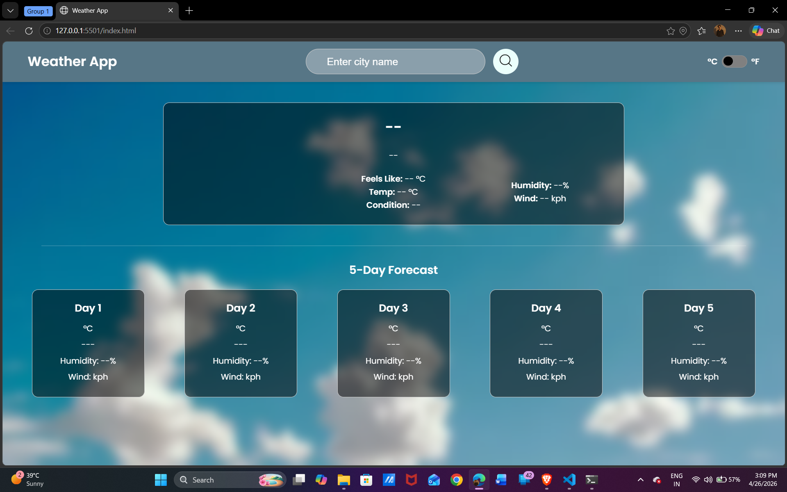
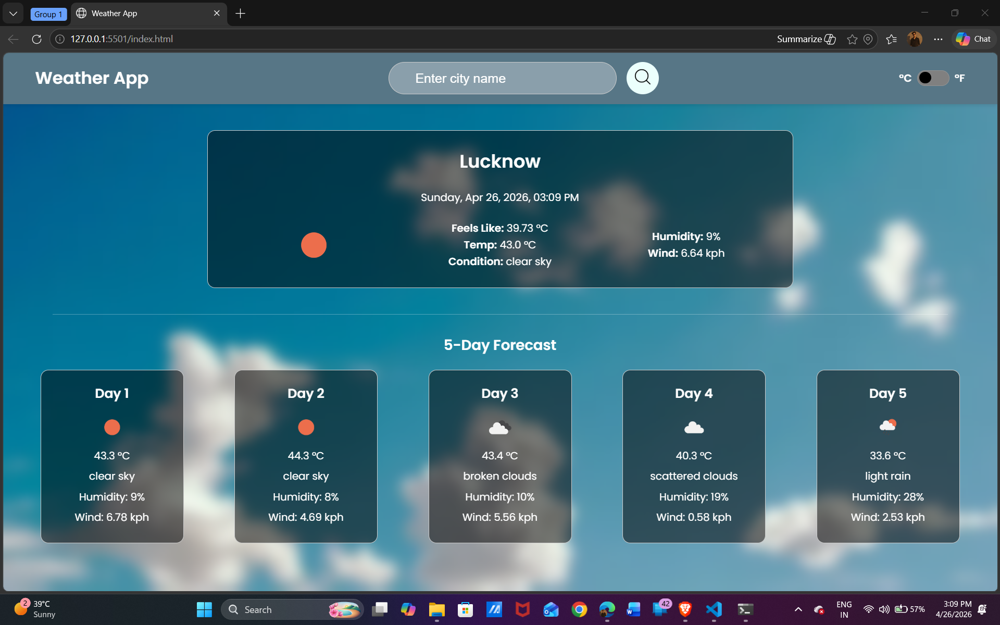

# 🌦️ Weather-App

<p align="center">


</p>

<p align="center">
A clean, fast and modern weather web app that provides real-time weather conditions and 5-day forecast for any city worldwide 🌍
</p>

---


#  Screenshots

##  Home Page

<p align="center">
  
  
</p>

---

#  Features

✅ Search weather by city name  
✅ Real-time temperature updates  
✅ Feels like temperature  
✅ Humidity level  
✅ Wind speed  
✅ Weather conditions  
✅ 5-Day Forecast  
✅ Responsive UI  
✅ Clean design  
✅ Error handling for invalid city  
✅ Fast loading performance  

---

#  Tech Stack

| Technology | Use |
|------------|-----|
| HTML5 | Structure |
| CSS3 | Styling |
| JavaScript (ES6+) | Logic |
| Weather API | Real-time Data |

---

#  Project Structure

```bash id="e4sz7p"
Weather-App/
│── index.html
│── style.css
│── script.js
│── README.md
│── assets/
│   ├── image1.png
│   └── image2.png
├── Screenshots/
│   ├── preview1
│   └── preview2
└── README.md

```

---

## Installation

1. Clone the repository

```
git clone https://github.com/fsid908/Weather-App.git
```

2. Navigate to the project directory

```
cd Weather-App
```

3. Add API Key

```
const apiKey = "YOUR_API_KEY";
```

4. Open `index.html` in your browser.

### 🔗 API used

<ul>
<li>WeatherAPI</li>
<li>OpenWeatherMap</li>
</ul>

---

#  Future Improvements

✅ Dark Mode
✅ Auto Detect Current Location
✅ Hourly Forecast
✅ Better Animations
✅ Voice Search
✅ Multiple Language Support
✅ Save Recent Searches

---

## License

This project is licensed under the MIT License.

---

## Contributing

Contributions, issues and feature requests are welcome.

---

## Support

If you like this project, give it a ⭐ on GitHub.

---

## Author

**Farhan Siddiqui** </br>
Git Hub : https://github.com/fsid908 </br>
LinkedIn : https://www.linkedin.com/in/farhan-siddiqui-dev </br>
Email : fsid738@gmail.com

---
Made with ❤️ by Farhan Siddiqui